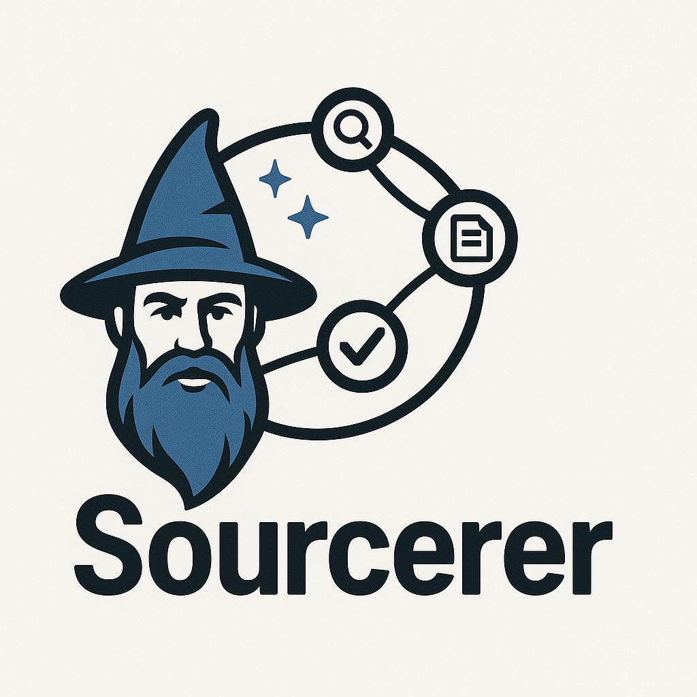

# Sourcerer

<p align="center"></p>

Sourcerer is an AI-powered assistant that can verify claims using Google Fact Check Tools API and perform web searches with Tavily API, returning concise answers with source citations. It consists of two components:

- **Agent**: A FastAPI server running a LangGraph workflow with `FactCheckClaim` and `FindWebSearch` tools.
- **UI**: A Next.js application using CopilotKit React UI for chat interaction.

---

## Features

- Verify factual claims via Google Fact Check Tools API.
- Fallback to web search (Tavily API) when no fact-check exists.
- Clear answers with citations.
- Modern, responsive chat interface.

## Prerequisites

- Node.js (>=16) with pnpm or npm
- Python (>=3.8)
- Poetry (for Python dependencies)
- Environment variables:
  - `OPENAI_API_KEY`  (OpenAI API key)
  - `TAVILY_API_KEY`  (Tavily web search API key)
  - `GOOGLE_API_KEY`  (Google Fact Check Tools API key)

## LangGraph Studio

LangGraph Studio is a web-based UI for visualizing and debugging your LangGraph workflows.

To launch Studio:

```bash
cd agent/sourcerer
poetry run langgraph studio --source sourcerer/langgraph/agent.py --port 8081
```

Open http://localhost:8081 in your browser.

Alternatively, if installed globally:

```bash
pip install langgraph
langgraph studio --source agent/sourcerer/langgraph/agent.py
```

## Setup

### Agent

```bash
cd agent/sourcerer
poetry install
cp .env.example .env          # add your API keys
poetry run python sourcerer/demo.py
```

The agent will start at `http://0.0.0.0:8000` with a `/copilotkit` endpoint.

### UI

```bash
cd sourcerer_ui
pnpm install                  # or npm install
cp .env.example .env.local    # add your OPENAI_API_KEY
pnpm run dev
```

Open `http://localhost:3000` in your browser to chat with Sourcerer.

## Project Structure

```
examples/clerk
├── agent/sourcerer
│   ├── sourcerer/langgraph   # LangGraph nodes and state
│   ├── sourcerer/demo.py     # FastAPI entrypoint
│   ├── pyproject.toml
│   └── .env.example
├── sourcerer_ui
│   ├── src/components/Main.tsx
│   └── .env.example
├── README.md
└── LICENSE
```

## License

MIT License. See [LICENSE](LICENSE) for details.
